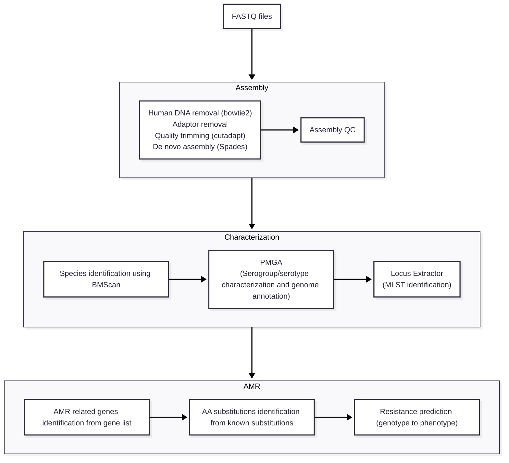

# BMGAP-Pipeline-2.0

This repository holds the code to run the pipeline for Bacterial Meningitis Genomic Analysis Platform (BMGAP) on the command line.  

This pipeline is used for processing raw reads from a sequencing run and currently only supports Illumina platforms.  This pipeline was tested on Sun Grid Engine (SGE)\
and automatically submits jobs to your cluster.  To pass variables in from the Conda environment, ensure the use of -V when submitting jobs.
### Installation
Creating the environment from *yml file:
```
conda env create -f BMGAP_Conda_all.yml
```
Download and store human genome:
```
aws s3 --no-sign-request --region eu-west-1 sync s3://ngi-igenomes/igenomes/Homo_sapiens/NCBI/GRCh38/Sequence/Bowtie2Index/ ./analysis_scripts/hg38
```

Build the PubMLST database in the [PMGA folder](./analysis_scripts/PMGA) within the analysis_scripts directory (**NOTE: The database should be updated regularly based on usage frequency to ensure the most current PubMLST data):
```
python analysis_scripts/PMGA/build_pubmlst_dbs.py -o analysis_scripts/PMGA/pubmlst_dbs_all
```

### Usage
```
BMGAP-RUNNER.sh <FASTQ_DIR> <ANALYSIS_DIRECTORY>

arguments:
	FASTQ_DIR		Input Directory: Directory of paired-end FASTQ files to analyze
	ANALYSIS_DIRECTORY	Output Directory: Directory where results should be placed in 
```



### Data Sharing request
We encourage you to send results to CDC to have the most robust molecular surveillance system.

The following is how you can submit data to our national molecular surveillance system from [analysis_scripts](./analysis_scripts):
```
PrepareToShare.sh <Result directory> <Lab_Name>
```
This will produce a .tgz file.  Please attach this compressed file to an email along with a metadata spreadsheet to mpdlb_informatics@cdc.gov.

By providing data back to CDC, you will help enrich our surveillance system and will help other public health labs in the process, even across jurisdictional lines. Also by providing data back to CDC, you are allowing us to place the data in a secure database accessible only by our partners in public health.

CDC database can be accessible by using SAMS account.  If you would like access to a SAMS account, please reach out to mpdlb_informatics@cdc.gov with a request.
*User can only access their own data , depending on the permission

### Testing the pipeline
To verify the proper installation of the pipeline, database and dependencies, test files and expected results are located in the [test folder](./test).
Run the test isolate and compare its results with the expected results to ensure they match.

